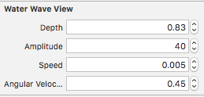

<h1 align="center">CLWaterWaveView</h1>

<p align="center">

</p>

<p align="center">
<a href="https://developer.apple.com/swift/">
  
</a>


</p>

## Features


* **Simple configuration**
* **Live editing**

## Example

To run the example project, clone the repo, and run **`pod install`** from the Example directory first.


## Usage

#### Interface Builder
In Interface Builder, select wave view, and in attributes inspector set values:



#### Code

```swift
import CLWaterWaveView

let waveView = CLWaterWaveView()

// configure the wave
waveView.amplitude = 39.0
waveView.speed = 0.009
waveView.angularVelocity = 0.37
waveView.depth = 0.37

waveView.startAnimation()

// to stop animation
waveView.stopAnimation()
```

## Installation

CLWaterWaveView is available through **[CocoaPods](http://cocoapods.org)**. To install
it, simply add the following line to your Podfile:

```ruby
pod 'CLWaterWaveView'
```

## Author

**Cristian Lupu, lupucristiancptc@gmail.com**

## License

**CLWaterWaveView** is available under the **MIT license**. See the **[LICENSE](https://github.com/cristiLupu/CLWaterWaveView/blob/master/LICENSE)** file for more info.


